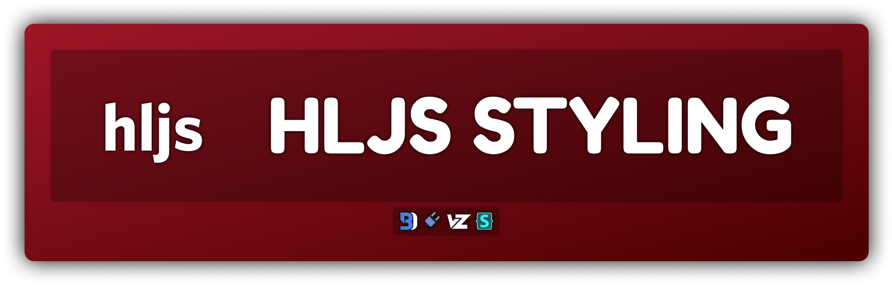
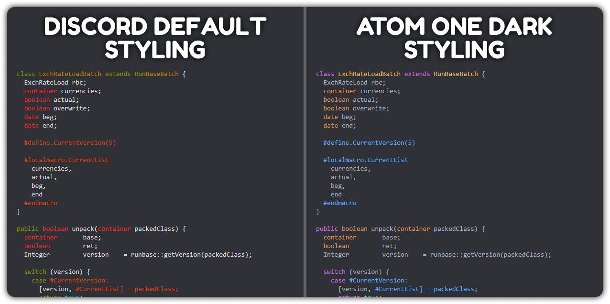

# HLJS Styling
Gives customization to Discord's default codeblocks. Colors are based off of the [Highlight JS Demo](https://highlightjs.org/static/demo/).
- Please be warned that if you want to create a specific style of your own, it's going to be a pain. If you successfully create a style, feel free to make a pull request adding it to the styles folder.



## Installation
For **[Powercord](http://powercord.dev/)** or **[Vizality](https://vizality.com/)** installation, go to **Themes -> Open a CMD / Powershell / Terminal / Gitbash** in the folder, and enter the following:
```
git clone https://github.com/Discord-Theme-Addons/hljs-styling
```

**For [BetterDiscord](https://betterdiscord.net/):**
- [Direct Dowload](https://betterdiscord.net/ghdl?id=3681)
- [View Source](https://raw.githubusercontent.com/Discord-Theme-Addons/hljs-styling/main/src/support/HLJSStyling.theme.css)

**For Browser / Web:**
1. Install the Stylus extension for [Chrome](https://chrome.google.com/webstore/detail/stylus/clngdbkpkpeebahjckkjfobafhncgmne) / [Firefox](https://addons.mozilla.org/en-US/firefox/addon/styl-us/) / [Opera](https://github.com/openstyles/stylus/wiki/Opera,-Outdated-Stylus).
2. After installing, head over to [this link](https://raw.githubusercontent.com/Discord-Theme-Addons/hljs-styling/main/src/support/HLJSStyling.user.css).
3. Press the "Install Style" button.

## Style Changing
On Powercord & Vizality, you can simple change the import to use the specific styles located in the `./styles` folder. On BetterDiscord & Web, you will have to replace what's inside of the root.
- If you want a specific style, however it isn't available, you are free to make an issue on this repo suggesting that style.