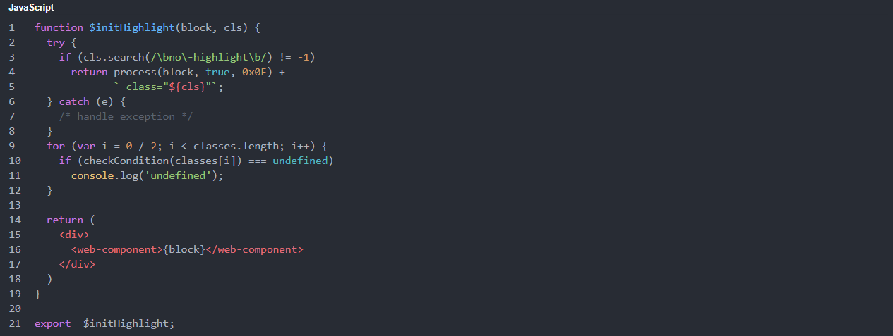
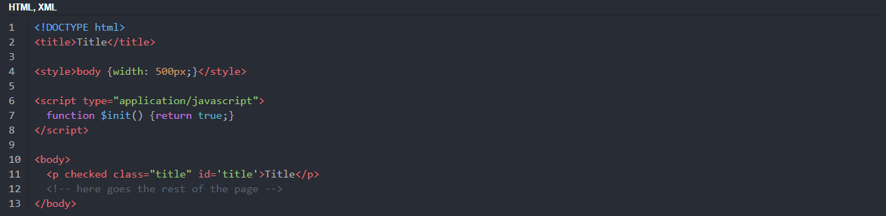
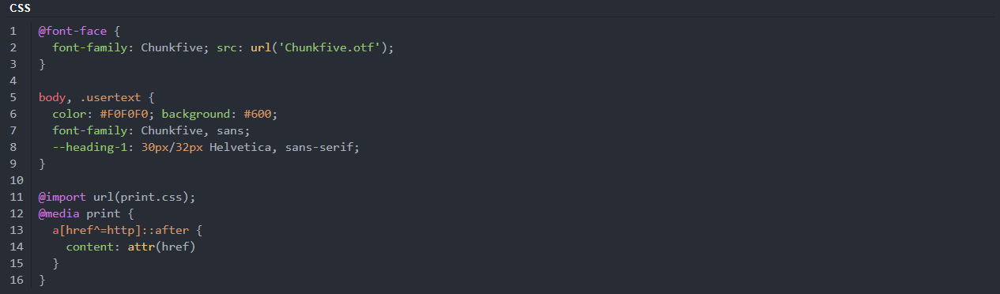

# HLJS Styling
Change Discord's default codeblock style. Based on styling from https://highlightjs.org/static/demo/

# Installation and Updating
For installation, go to **Themes -> Open CMD / Powershell / Terminal / Gitbash**, and enter the following:
```
git clone https://github.com/LuckFire/HLJS-Styling
```

Powercords updater is currently broken, so in order to update the theme you will have to do it manually. To do it manually, go to **Themes -> HLJS-Styling -> Open CMD / Powershell / Terminal / Gitbash**, and enter the following:
```
git pull
```

# Styles
The default style that this theme comes with is Atom One Dark. If you'd like to change from this theme, go into the **HLJS-Styling** file and replace the variables, as simple as that. If you'd like to create a custom style and have it added, make a pull request adding the style into the "styles" folder.

# Previews
### JavaScript


### HTML


### CSS

